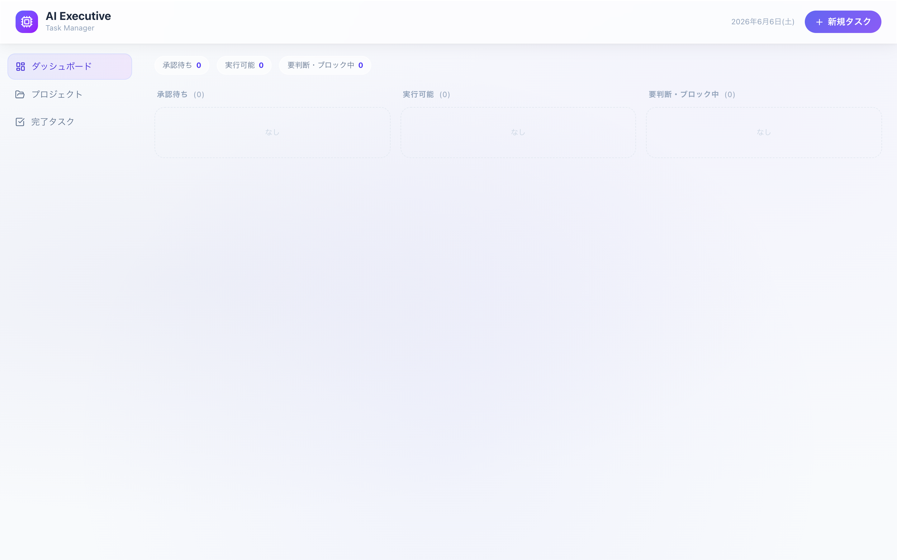
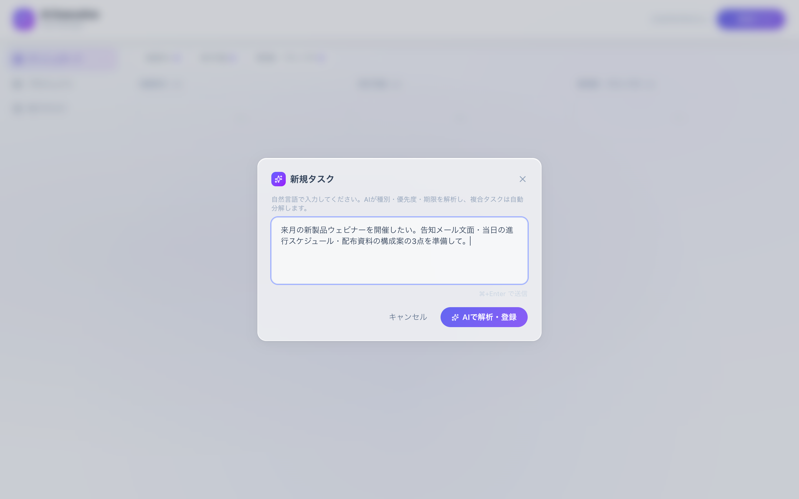
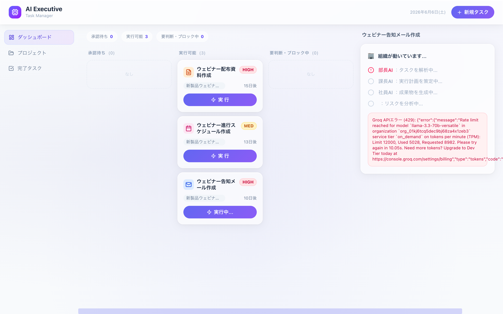

# task-manager — AIタスク管理アプリ

> 自然言語の入力からタスクを整理し、カレンダー（ICS）に書き出せる、AI支援タスク管理アプリ。

[](https://vitejs.dev/) [](https://www.typescriptlang.org/)

---

## スクリーンショット

自然言語の指示を「部長AI → 課長AI → 社員AI → リスクAI」の多段パイプラインで分解・実行する AI Executive ダッシュボード。

| ① AI Executive ダッシュボード | ② 自然言語でタスクを入力 |
|:---:|:---:|
|  |  |
| ③ AIによるタスク自動分解プレビュー | ④ 多段AIパイプライン実行中 |
|  |  |

---

## 概要

タスクの入力・分類・進捗管理を行うシングルページアプリ。AIによる入力補助（`AIStatusDisplay` / `TaskInput`）と、予定を `.ics` 形式でカレンダーへエクスポートする機能を備える。

---

## 主な機能

- **タスク入力** — テキストからのタスク化（AI支援）
- **タスクカード** — 状態管理・編集
- **パネル/レイアウト** — 整理された作業ビュー
- **ICSエクスポート** — `utils/ics.ts` でカレンダー連携

---

## 技術スタック

`React` `TypeScript` `Vite` `Tailwind CSS` `lucide-react`

---

## セットアップ

```bash
pnpm install
pnpm dev       # 開発サーバー
pnpm build     # tsc -b && vite build
pnpm preview   # ビルド確認
```

---

## このプロジェクトで見せられること

- 軽量な **Vite + React** SPA設計
- 外部標準（iCalendar/ICS）との連携実装
- AIをUIに自然に組み込むUX

---

*※ ポートフォリオ目的の公開リポジトリです。*
